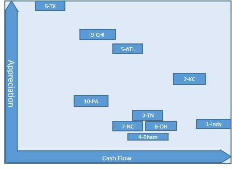
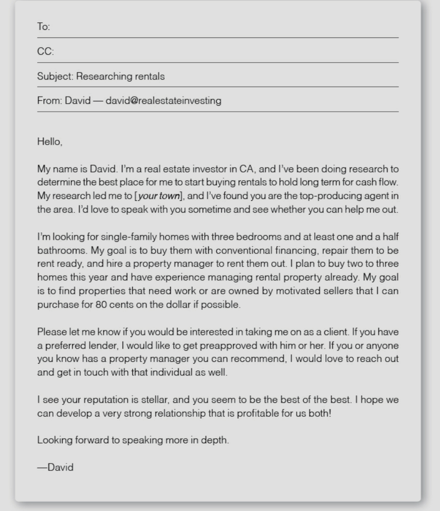

# FINDING PROPERTIES

Always be on the lookout.
Keep learning and collecting data points - helps you to internalize value and recognize deals quickly.
Most important is finding the deal - deals are made WHEN BUYING!!

### How to find Value

There has to be a reason why you can get the house at under market value. Be aware of this!
Keys to a property you want:

1. The house needs upgrade/repair/Foreclosing/Bank owned and wants to unload
2. The owner is motivated to sell under market value
3. It is in an area of town where people want to live (there will be demand to rent/buy later)

### Rental Portfolio

- Single/Multifamily Rentals with over 1.2% Rent to Value ratio.
- Be aware of too good to be true 2% RtV - often bad neighborhoods and not worth the headache - tip from experienced investors - also beware maint costs - same price for new HVAC in 50k and 100k house
- Solid Property Management - either in place or able to connect with some (So important! This is a make or break aspect - can make life terrible or awesome later)
- Great Locations!! This is very important. I want somewhere that people will want to rent, and that will be easy to manage. One eviction = thousands in damage, vacancy, legal fees, etc. Don't just look at spreadsheet numbers

### Turnkey Hotspots:

## Leads

1. Wholesale lists (Get on some good ones!)
2. Investor friends, family, coworkers (Business Card)
3. Realtor Agents
4. Providers (Memphis Invest, Midsouth Homebuyers, Norada, REITrader)
5. Craigslist, Zillow, MLS
6. Foreclosures: Shadow inventory - inventory held by banks you dont know exists, local auctions

### Business Cards

Have Contact Info
"If I close on a real estate transaction due to your referral I will send you a check for $500."
A realtor cannot pay a finders fee (but i can)
Guys like delivery drivers, postman, etc are driving around all the time

### Online Search

- repropfinder.com - The RE Elevated software??

- Honolulu Star advertiser Foreclosure section -

- Foreclosures.com -

- Auction.com -

realtor.org
realtrends
bestplaces.com
realtytrack.com

city-data.com

realtor.com
streeteasy.com
national re franchise websites
realtor office and websites

bestplaces.net
case-shiller index - shows prices over time

property research:
ebay
craigslist
backpage
zillow
trulia

18 keywords to look for when searching craigslist:
motivated, reduced, owner may finance (owf omf), pre-foreclosure, foreclosure, short sale,
divorce, reo, probate, estate, relocation/relo, owner will carry /owc, fire or storm damage, tlc, fixer,
investor, discount, bring,

www.propertyauction.com
www.realtybid.com
www.auction.com
www.williamsauction.com

us treasury
hud.gov
fsbo.com
forsalebyowner.com
owners.com

facebook
instagram
twitter

newspaper classifieds (online too)
50states.com

renatus ios???

### Wholesale/Agent List

Dallas, TX

- Kerri -
  Teds Contact w husband David

- Homewood Properties Inc -
  Randy Quay, President
  randy@homewoodproperties.com
  Mobile 214-586-4000

- NetWorth Realty of Dallas -
  Mark Smithey
  msmithey@networthdfw.com
  Senior Acquisitions Associate
  (469) 265-6737 Cell
  www.networthrealtyusa.com

- myershomebuyers.com -
  Brett Lane
  brett@myershomebuyers.com

- Michael White -
  michael@bnmventures.com

- Sarah Rudy -
  Sarah Rudy <rhom@live.com>
  Prop Manager/Realtor/Owner turnkeyonline
  Lee Waters (Realtor)
  lee@turnkeyreonline.com

- Norada -
  Melissa N.
  Norada Real Estate Investments
  (949) 218-6668 x5
  (800) 611-3060
  www.NoradaRealEstate.com

- Reitrader -
  Jonathan Mednick, Managing Director
  REI Trader, LLC
  2320 Highland Ave. Suite 150
  Birmingham, AL 35205
  Cell: 954.383.6218
  Direct: 205.924.5045
  Office: 205.512.3040

- www.happyinvestor.com-
  Signed up

- https://investwithben.com -
  Signed up

- https://www.indywholesaleinvest.com -
  Signed up

* http://www.indianapolisinvestment.com/indianapolis_homes_for_sale.html -
  All these on the site are sold - its a hot market now
  Talking to the guy and hes gonna put me on the wholesaler list

### PROCESS - Finding New Agents

Look on Zillow (Zillow.com/agent-finder.) or Yelp and send an email to the agent with the following information:

1. That you are an investor who understands real estate
2. What specifically you are looking for
3. How you intend to purchase (loan, cash, and so on)
4. How you heard about the agent

Sample Email:

Sort through agents, and find one that will be able to bring you good deals. Also look at it from his/her point of view too. What is he/she getting - will you be doing a lot of business, bringing business their way?Rewarding them with extra compensation or helping them out too? Be aware of what value u bring to the transaction.

### Foreclosures

1. Preforeclosure. The property is listed to be sold at a public auction. Investors can purchase directly from the seller during the preforeclosure period.

2. Public Auction. The property iss put up for public auction, usually at the county courthouse. Investors bid on the property.

3. Real Estate Owned. If the property doesn't sell at auction, it goes back to the lender. Investors can purchase the property from the lender.

Sources of Foreclosures and Auctions:

- U.S Dept of Housing and Urban Development (HUD)
- Veterans Administration (VA)
- Federal Housing Authority (FHA)
- Federal National Mortgage Insurance Association (Fannie Mae)
- Federal Home Loan Mortgage Corporation (Freddie Mac)
- IRS
- Property Tax Sales (check your local taxing authority)

### Tips

Reward the people who bring you deals!
Look for win-win relationships
