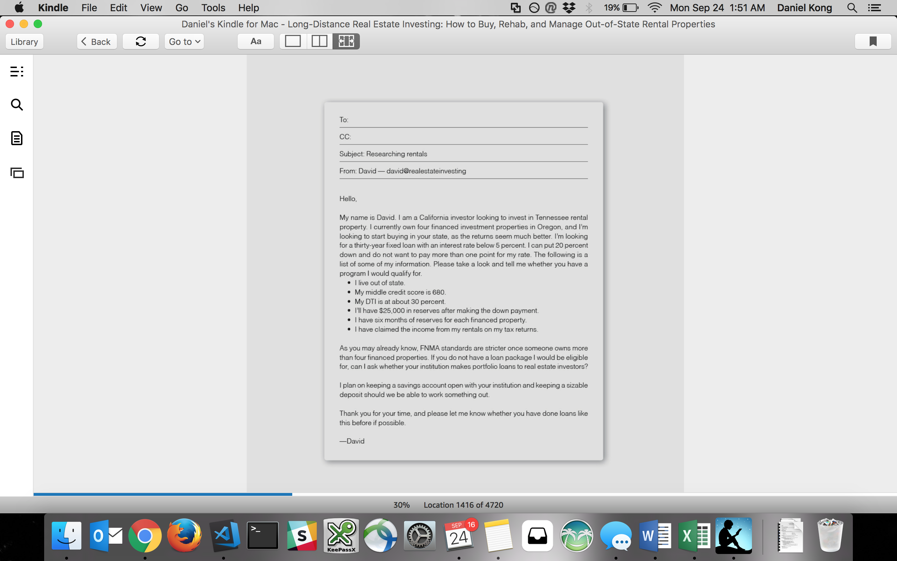

## 1.1. Getting Funding

---

### Lender List

- GatewayLoan -
  Andrew.Postell@gatewayloan.com
  Guy in Dallas that does the 85% quick refi

- Quicken Loans -
  (Caution - promised 15% down early - changed to 25% when actual loan and tried to push super high fees through - luckily i read the documents - Be Careful of Sales people here!!!)
  Bri Pero
  Mortgage Banker
  Email: BriPero@quickenloans.com
  Phone: (855) 508-1100, ext. 50792
  Fax: (855) 455-6675

- Highlands Mortgage -
  Graham W Parham
  Senior Loan Officer
  Highlands Residential Mortgage
  Toll Free Direct: 855-326-6802
  Office: 972-581-2998
  Cell: 214-679-3396
  Toll Free Fax: 855-326-6801
  Email: gparham@highlandsmortgage.com

  Aaron Stelly
  Loan Officer Assistant/Production Manager
  Highlands Residential Mortgage
  12001 N. Central Expressway, Suite 750
  Dallas, TX 75243
  Office: 972-581-1223
  Cell: 214-957-7484
  Toll Free Fax: 855-326-6801
  Email: astelly@highlandsmortgage.com

- Ridge Lending Group -
  Vona Harris
  Administrative Assistant
  Direct 503.244-4161
  Fax 503.821.7797
  e-mail vharris@ridgelendinggroup.com

  Caeli Ridge
  President
  Toll Free 855.74.RIDGE (74343)
  Direct 503.244-4161
  Fax 503.821.7797
  e-mail cridge@ridgelendinggroup.com

- Bank of Hawaii -

- University of Hawaii Federal Credit Union -
  Savings Account with 1% APY (applied monthly).
  5-7.5% APR personal loans (up to 5x gross monthly income)
  8.5% Credit Card!!! (10k max)
  Car Loans (need full coverage) - Can refinance too

- http://www.loans212.com/ -
  Partner with networthrealtyusa, can fund flips/rehabs commercially

- https://crosscountrymortgage.com/landing-pages/ccm-honolulu/ -

### 1.1.1. PROCESS - Collect and organize needed documents/records

Get all the documents you will need and into a neat and organized folder structure.
Having a financial statement, Resume, and business plan helps too.
You want to impress them and show them how professional you are. Often the decision is personal.

- Personal Financial Statement
- Business Plan
- W2s for the last 2 years
- 2 months of all Bank Statements (has to be full statements - not printed html)
- 2 paychecks of current employer(s)
- 401k Statment(s)
- Any stock or investment statements
- Documentation on existing loans and properties
- Aalii contract and agreement?
- Proof of Federal Tax payment

### 1.1.2. PROCESS - Find a Lender Online

1. Google search Local Lenders near your property:

   Investor-friendly banks (county you are looking in)
   Credit union (county you are looking in)
   Savings and loan institution (county you are looking in)
   Portfolio lender (county you are looking in)

2. Send them an email like this:

---

Hello! My is Daniel, and I'm an investor from Hawaii looking to invest in Tennessee rental property. This will be my first investment property, but I hope to do a lot more investing in your state in the near future. I'm planning to purchase a duplex for $96,000. I'm looking for a 30 year fixed loan with an interest rate of 5.5%. I can put down 20%. The following is a list of some of my information. Please take a look and tell me whether you have a program I would qualify for.

- I live out of state
- My credit score is 760
- My current DTI is 31%
- I will have $40,000 in reserves after the down payment

If you don't have a program that I would qualify for, is there another institution you could recommend me to? Thank you very much for your time and consideration!

Daniel

---

3. See if you can form a partnership and relationship with them, and refer others to them. Make sure everyone knows you are the connector.

4. Another avenue for local bank research: https://www.bauerfinancial.com/

### PROCESS - Find a Lender thru referrals

### 1.1.4. Get Pre-qualification letter

Fill out the lenders application and get the prequalification letter.
Be upfront what you are trying to do, and see if they can help you.

### 1.1.5. Get Approved for a specific property

Inform the lender you want to take out a loan.
Give them the property information

Some questions about the loan:

    What is the length of the loan? (30 yrs, 27, etc)
    What is the rate? (APR%) (If variable, minx max)
    Origination Fee? Other fees?
    Any points up front?
    Is there a pre-payment penalty?

## 1.2. Sources and Types of Funding

bank/credit union loan,
portfolio bank loan,
hard money lenders (3-5 points, 12-15% interest),
friends/family/partners,
lines of credit,
credit cards,
401k/IRA,
seller financing.

### 1.2.1. Line of Credit (HELOC, or Personal LOC)

The key thing to note, is that an LOC's interest is calculated PER DAY.
You can get the daily interest by taking the APR (Example: 2.7%), dividing by 12 - to get the monthly interest, then dividing that by 30 to get the daily interest. (They do it like this vs dividing by 365 according to the renautus guys).

Take out a line of credit at your local bank. For First Hawaiian Bank you can get one for 20k assuming your DTI is ok. If you want to go higher, you will have to provide some bank statements.

#### 1.2.2. HElOC

HELOCs are Home Equity Lines of Credit. It is a line of credit against the equity in your property that is above the 20% amount. You must always have at least 20% in equity in your property. Any equity over this 20% can be used as collateral for a line of credit against it. Example:

1. 100k home, with 20k of my money/equity. Since I'm at 20% and have nothing above the 20%, I cannot get a HELOC
2. 100k home, with 40k of my money/equity. Since I'm over the 20% threshold by 20k, I can get a HELOC for 20k
3. 100k home, with 80k of my money/equity. Since I'm over the 20% threshold by 60k, i can get a HELOC for 60k

These often come with low 1.7-2% introductory APRs for the first year. You can do strategic things here - Once the introductory rate is over, you can pay it off or cancel and open another HELOC with another bank lol.

One thing to note is that HELOC % is calculated by the day, so any balance used in a month will be charged interest. Credit Cards are charged at the end of the month. Use your Credit Card for daily purchases (you get points too) and only use your HELOC to pay off your CC as needed.

### 1.2.3. 401k/IRA (Individual Retirement Account)

- Pretax dollars put here (so you get more bang for your buck)
- Reduces income tax (money contributed is not counted as income)
- Must be 60 to withdraw penalty free, otherwise 10% penalty
- Roth means you put in after tax dollars
- 401k - 18k limit as of 2017, IRA 5.5k limit as of 2017
- Compound interest is POWERFUL!!!

#### 1.2.3.1. Datahouse 401k

- Datahouse is matching 20% of your investment up to 2400. Its added as a lump sum once a year in July.
- You have been averaging 10% yearly returns from your mutual funds investment.
- You can stop any time, but open enrollment is Dec to change amounts (for Jan implementation)

#### 1.2.3.2. Borrowing from your 401k

- You can borrow either 50% or 50k - whichever is less
- You have to pay back in 5 years unless its for a primary residence, or hardship, or special circumstance
- You will pay back interest but the interest all goes back to you
- If you quit or are fired, you have to pay it back in 60 days or incur a penalty
- Penalty for early withdrawal is 10%
- When you take it out for real, you pay income tax on it (Unless its a Roth)

### Credit Cards

Always increase your limits given the chance. This helps you to lower your utilization % which helps your credit score, and also gives you access to more emergency funds should you need it.

### Self-Directed IRA

### Some other Retirement fund?

### Tips

Get as much funding as you can when possible. Its easier to take out 100k from the start, versus going for 20k, 20k, 40k, 20k in succession. Cool story of borrowing money from your friend using both methods.
