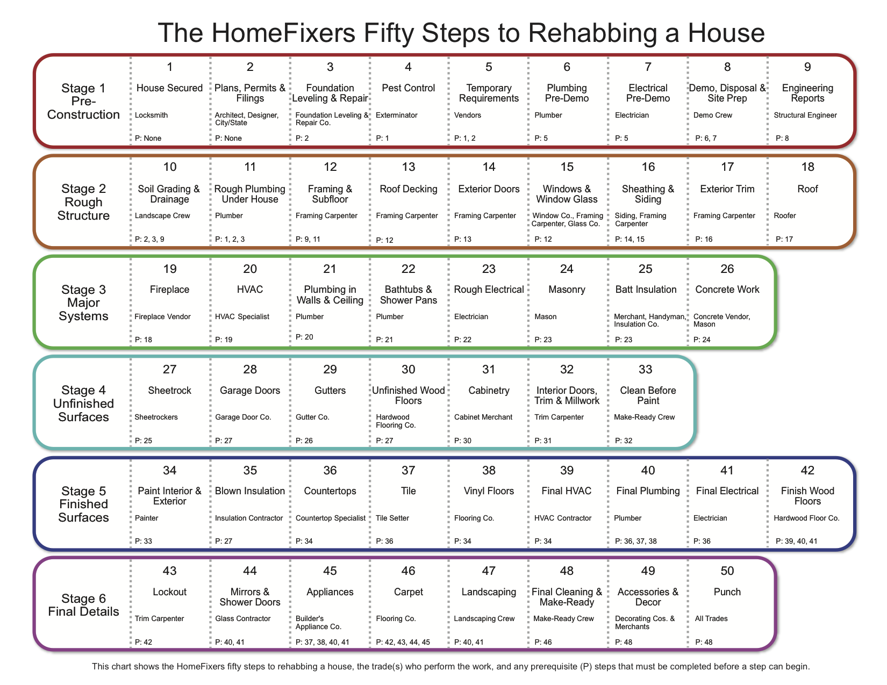

# REHAB

The actual rehabing starts far before the house is bought. Prospecting, analyzing, and estimating costs all play a part in the process. The Book "Flip" outlines the entire process. For a good visual overview of the process see the pdf here: [PDF of the Entire Process](lib/FLIP_Figures.pdf)

Flip vs Rent Rehab - Flips will need to be nicer to have someone to buy vs Rent needs to be decent enough to rent.

Never over-rehab the house, or under-rehab the yard. Curb appeal is SO IMPORTANT!

Need to profit AT LEAST 30k

### Types of Equity

1. Fixed - bought at a discount
2. Forced - thru rehab
3. Future - appreciation

### PROCESS - Assess the rehab costs

Very important - and also easy to get wrong!

1. Hire a professional. This will be the most expensive, but maybe the most worth it.

2. Do it yourself or ask a Realtor. Cost of materials and cost of construction itself. Also some tasks require specialists (faoundations, structural, septic, well, chimney, pool, etc) Do enough of these however, and you will get better and better at it. Like anything, the more experience and data points you have. Always add at least a 5% contingency for unforseen costs or overruns.

3. Use a rule of thumb. Only use this if you need to do it overnight - time is of the essence.
   1. Make-hab ($5/square foot, $3-7) Clean out, paint, carpet, final cleaning
   2. Rehab ($15/square foot, $12-18) Mostly cosmetic, broken windows, leaky roof, HVAC, electrial, plumbinb, doorknobs, doorstops, bathroom accessories, tile, refurbishing cabinetry, trim, landscaping.
   3. Remodel ($25/square foot, $20-30) Rehab plus replacing bathtub, walk in showers, cabinetry, doors, trim, widening openingss.
   4. Restructure ($40/square foot, $35-45) Remodel plus major layout changes - moving a bathroom increasing kitchen, building an addition, etc.

Use the Homefixers app to estimate easier. Maybe can order a HomeFixers Cost Assessment Report depending on the city. https://househackerpro.com/upgrade.html

NOTE: Other costs to include with the rehab are the costs of closing (Closing fees, inspections -1.5%), Holding (Taxes, Utilities, HOA fees, etc - 1.5%), Lending fees (variable), and if flipping, then Selling Fees (6.5% selling price)

Estimate the time it will take to fix: Get the cost per square foot and divide by 10 - that will be how many months it will take. Add two and a half months to market and sell.

Estimating minimum amount of profit - 10% of selling price PLUS an additional amount depending on the complexity of the rehab. A good rule of thumb is to add 1% for every $5/square foot of rehab cost.

### General overview diagram of the rehab process

Here is the same 50 steps broken up a little more:

[PDF of Common Tasks](lib/FLIP_101-Common-Tasks.pdf)

[Must Fix List](lib/FLIP_Must-Dos.pdf)
[Should Fix List](lib/FLIP_Should-Dos.pdf)

### Holding Costs

Be aware of holding costs when estimating the rehab. This will include Property Taxes, Insurance, Utilities, Maintenance costs like cleaning or yard service, and HOA fees.

### Working with a Contractor

Hiring

- Clearly spell out the payment schedule (varies depending on the size of the job and region, typicically 1/3 down and balance on completion)
- If you are not planning to rent the property consider offering 50% up front and 50% when the property sells
- Never make the final payment until the job is 100% complete
- Agreement should stipulate that all changes must be in writing and signed by both parties. Once you build relationships, then you dont need it in writing.

Make sure they are legit - ask for:

- Certificate of Insurance (Is it Active?)
- 3 Types of insurance: Property damage, General liability, Workmans' Compensation
- One million dollar umbrella, YOU/CCO.

#### Getting Bids

#### Ordering Materials

#### Paying the Contractor

Rental rehab biggest/most value pop

1. Fresh paint
2. New carpets
3. New Front Door

### Things to consider

1. Is it fine?
2. Does it need to repaired?
3. Does it need to be replaced?
4. Does it need to be updated

### Rehab Tools

Flaghslight
Measuring tape (Laser)
Graph paper (one square is one foot??)
Camera
Pencil
Buy a terabyte drive and video everything u do

### Rehab Notes

Biggest Bang for Buck

1. Painting (Buy exp for rentals so u dont have to repaint)
2. Carpeting (Wood/pergo flooring will look a lot nicer so be aware of this)
3. Landscaping

#### Exterior

Curb Appeal
Roof (it only has to last until you flip it) - can put a detergent on it to get it brand new
Concrete/Walkway (Can seal cracks for 800, vs 10-12k to replace the driveway)
Pool (Never buy a house until you have someone inspect the pool and pool equip - can easily be 20k)
HVAC (just cuz its running doesn't mean its working - shut it down and be there when it starts up again)
(could be 5-7k)
Garage Door (Does it shake or rattle on its last legs - 1.5k per mechanism)
Windows can eat budget fast - when you have to rip the stuco out to replace - could be 1k each
Landscaping - husband - do i gotta do a lot of work?? Gravel and irrigation vs hedges/bushes
Smells from up the street/Noise from outside the house
Paint - trim today = gray/white/silver, paint electrical boxes and all - be aware the contractor agrees to it, and won't make an extra charge later

#### Interior

Open the house up
It makes sense to stage a home when you can do it for 1% of the sell price (base (4-6k), mid (8-10k), full (14k))
You can buy things that bring color for staging and use it over and over
(tip: put a glass of wine and two glasses on the counter)

Most Important Rooms

1. Kitchen
2. Master Bedroom
3. Bathrooms

Kitchen

1. Cabinets (Can put storage in the master bathroom)
2. Fixtures
3. Counters Appliances
4. Walls Removed
5. Flooring
6. Custom Lighting (drop lighting, track lighting)

Bathroom

1. Countertop
2. Vanity
3. Shower
4. Toilet
5. Tile

### Rehab Notes

1. What is not gonna be here when we sell? Take out and demo inside completely first
2. Then do outside to attract attention (paint front to back)
3. Sell while doing inside - Market while inside being fixed - allows buyer to have a say
4. Buyer pre-approved
5. Don't let subs do work w/o permitting - Permit should be hanging outside the house? Always pull permits
6. Beware people who want to work nights/weekends
7. Estimate how long it'll take subs to do work.
8. 6% are 1939 and older - properties built before code (Check if its listed historic - check w the grant officer can get free money to rehab a house) you will have to rip out the wiring and plumbing in that house.
9. Dont do work you dont know how to do. If you dont do it for a living, you dont know how to get the right result.

#### Permits

1. Structural
2. Electrical
3. Roof
4. Plumbing
5. Windows

### Rehab process flow

You want one project in each stage at any point in time - keep churning these badboys out

1. Identify

2. Tear Out

3. Rehab

4. Pay out

### Discounts

Lowes, Home Depot, at the end of the year they are cheaper - so buy them then, and save them for future rehabs

lampsplus.com - everything restoration hardware store has but at discount

Register at Home Depot with the commercial pro desk
They have discounted items that "dont meet spec" for you to buy

### Tips

After buying the house, introduce yourself to your neighborhood, and talk to them
let them know you are gonna shine it up
Do you wanna have some input into who your neighbor is?
Pass out your cards, and let them know you will give them a $500 referral fee. (Write their name down on the cards)
"If you see someone pull up and ask, give them this card and we'll give u the referral fee"
Staging - poupori to spruce up the smell, Lights - keep it lighted and bright, Make it fee like home

### Rehab to hold

1. Paint using neutral colors
2. Drive thru neighborhood see what other investors and builders are using - current trend?
3. Same color paing and carpeting throughout
