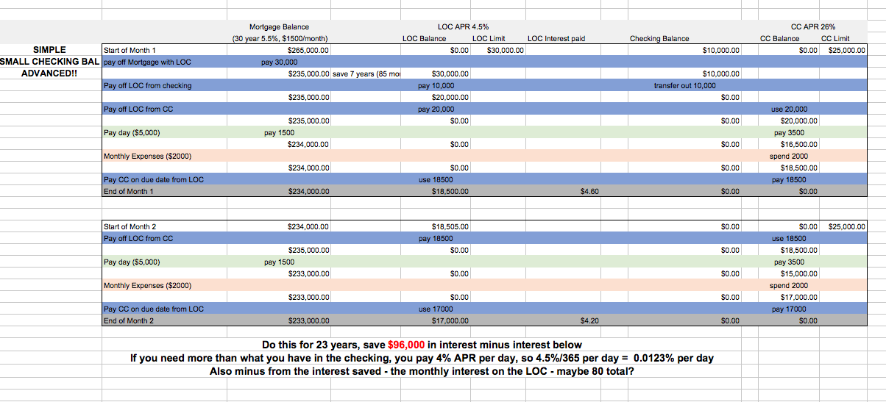

# General Investment Strategy and Processes for Turnkeys

---

## Research more List

uh credit union

Aurbnb??? - evaluate cost analysis of this
Agreement for Deed
Subject to
Calculations -
Diff ones you need to know and how

closing process
closing fees

Renautus? Workshop?

Quickbooks taxes -

neighborhood scout

inn on the park - 1920 ala moana

setup llc in vegas???

HELOC DTI

increase my cc limits????
Use the miles - pay it off with your bank account

Check with an accountant

Donald Graham? Accountant - Baron Graham is the realtor

heloc - makes the money in your property accessable

1st and second mortgage
1st time home owner - double mortgage to get to 5%

liquidate stuff in house - side hustle??
Ebay my extra stuff tonight!!!

Research the markets and compile data ...

## Set your goals and find your why

Its gonna be hard. When things are not going right, you need to find that spark or reason to keep perservering and pushing through. Remember your WHY!!

Freedom to spend more time with wife and family.
Freedom from worrying about money.
Freedom from being forced to work hard in a job with no end.
Ability to help others around me.

## Growing in this space and as a person

1. Build your team

   - inner circle - mentors/peers - more exp and success than you and willing to help/guide you - board of directors or millionaire masterminds - will help or connect u, could be support circle too - touch them once a month
   - support circle - professional team - advice and management - details of what you need and will help find people you will contact - transaction advisors and managers - have ability to manage the diff pieces (real estate agent, etc) touch them on every transaction
   - service circle - independent contractors - inspectors, electricians, painters - limited scope - personally direct or support team will direct

2. Building Relationships

   - Call them once a month - 2 calls a day will touch everyone in your network
   - Mail them something interesting every month
   - See them every month in person
   - Review you net worth worksheet with someone - and ask them to keep you accountable
   - Ask yourself - who am i calling today, who am I seeing this week, who am I mailing this month?
   - Two questions to ask someone:
     - Who do you know that I should know?
     - What would you do if you were me?

3. Build a reputation

   - Do deals - you need to be involved - make offers, take deals, etc
   - Keep your word - do what you promise, and show up on time
   - Dont talk bad about anyone - nobody trusts a gossip
   - Dont short change anyone - time or money
   - Refer business to your network - help people make connections

4. Reading/Listening to Books and Watching Videos

   - Keep growing and learning!!

## PROCESS - Finding a Property (Generating Leads)

- What am I looking for (Initial Property filter)

  - Turnkeys in the 80-120k range. Below 70k will be bad neighborhoods or need massive repairs. This also seems best reserve amount - 10% of 70k is 70 a month, while 10% of 100k is 100 a month, even tho water heaters cost the same for both properties...
  - Positive cashflow - most important part, more than appreciation
  - A/B Neighborhoods - Sticking to decent neighborhoods - there are too many horror stories from friends an online about C and D class neighborhoods. Anson has a few lol.
  - No Section 8 housing - Same as the C/D class neighborhoods, too much risk and cause for headaches down the road.
  - Property management in place. Its important to not only have a property manager, but a good reliable one in place here. This will make or break your rents in the future, and will be your lifeline down the road.
  - Already rented, or property manager confident can find renters quickly.

- Avenues to find them

  - Personal Contacts/Network
  - Turnkey Providers (Norada, ReiTrader, JWB, Memphis Invest)
  - Craigslist
  - MLS

- General tips
  - Always be on the lookout - Finding good deals is the most important part of investing
  - Keep researching and looking at real estate - constantly collect data points - the more you see, the better your instinct on what a good deal is becomes (you need to internalize this)
  - Truepeoplesearch - find the person owning the property and contact them directly?

## PROCESS - Researching a Property

1. Property Location

   - Use NeighborhoodScout for a report: https://www.neighborhoodscout.com/
   - Population makeup - ethnicity, age, demographics, crime, etc.
   - Population growth? Is it growing?
   - Is the Job market diversified? (If a big company pulls out of the area, will jobs be lost?)
   - Any new companies moving in or out soon? Any big events trending soon?
   - Housing market - Are prices going up? Also look for a low foreclosure %
   - Look for a low cost of living.
   - What is the vacancy rate of the city?
   - What are the insurance prices in the area?
   - Any special conditions? Flood zone, or hurricane prone (Florida, etc)
   - Nice graphic about appreciation and cashflow here: [link image]

2. Turnkey Company & Questions to ask

   - Vetting the Turnkey Vendor will make life easier in the long run. Find out as much as you can about them as a company to see if you can work with them, or thier providers.
   - What is their repuation like on Bigger Pockets?

   Questions

   - Can you tell me more about your company?
   - What is your role in the process? Buy? Rehab? Sell? Property Management? (This always better if they own the entire process - makes it easier to find a point of contact and back up their work)
   - If you are a middle man, how do you vet the actual providers?
   - Ask them "What separates you from other companies?"

3. Property Value & Questions to ask

   - Pass the initial property filter in the "What am I looking for" section above
   - Plug values into the Investment Calculator - good margin? (Want 200 positive cashflow)
   - Monthly Property Tax: https://www.qpublic.net/
   - Monthly Insurance
   - Does the property need repairs currently? Will it soon?
   - Deals are made going in - Make sure its a good investment!! You can always find another..
   - Best value around the 100k range. Too cheap and you get issues? Also as you go lower in price % maint and % cap exp go down - even tho things will cost around the same...
   - Service to go take pictures of the house and get intel without their permission.

   Questions:

   - Do you own the property? If not, who is the company/person who is selling it? Always better selling their own
   - Was the property rehabbed? Who did the rehab? Always better to know the rehab workmanship personally
   - Does it currently need any repairs? If so, what do you think the estimated costs will be?
   - Can you tell me a little more about the neighborhood (want them to describe it in their own terms)
     Big 6 Cap Exp Questions - Find facts and also get a feel on how they answer. Ask Hey ball park numbers, what would it cost to redo the roof, etc - just to get a feel
   - When was the last time the roof was done?
   - HVAC?
   - Foundation - any issues? any work done and repaired?
   - Termites?
   - Plumbing?
   - Electrical?

4) Property Management & Questions to ask

   - Find out more about the property management team and make sure you are comfortable working with them, and they have reasonable rates. Nothing is more important to the success of your property or peace of mind, than the property management company and their communication, responsiveness, and committment to excellence. Good chance this guy doesn't care about your investment - make sure you are comfortable here - find the right team!

   Questions:

   - Can you tell me more about your property management company? (How much experience do they have?) How do you handle problems - how big are you? Processes in place..?
   - What are the fees? Setup fee - say $300 to open account - Monthly 8%-12%? Is this on rent Collected, or rent due, rent scheduled, rent value, etc. It should be on rent collected to assure not paying when there is no rent. Vacancy Fee? Listing/new tenant fee? Lease renewal fee? Maintenance fees? Eviction fee?
   - What is their average vacancy rate? (Charge when there is a vacancy?) So important to keep rentals filled...
   - Are there Tenants currently? (Rent Rolls available?) (Lease Agreements?) How sure is the rental price? If you are unsure here, then call around for property managers in the area and get their opinion - you can possibly go with one of them if you like them as well (Yelp is a good resource). Also Hotpads research surrounding similar rentals.

### Turnkey Location Hotspots

### Insurance

Home Owners
Liability
Flood?
Hurricane?

### PROCESS - Creating an LLC

### PROCESS - Finding a Lender and getting approved

1. Get all the documents you will need and into an organized folder

   - W2s for the last 2 years
   - 2 months of all Bank Statements (has to be full statements - not printed html)
   - 2 paychecks of current employer(s)
   - 401k Statment(s)
   - Any stock or investment statements
   - Documentation on existing loans and properties

2. Search for and contact a Lender
   You can do this through a web search or through referral from a friend. Lane Kawaoka said certain banks wont fund investments, so its better to go with ones that are familiar with the process and the risk. Current lenders I have a relationship with are:

   - Quicken Loans (Caution - promised 15% down early - changed to 25% when actual loan and tried to push super high fees through - luckily i read the documents - Be Careful of Sales people here!!!)
   - Highlands Mortgage
   - Ridge Lending
   - Bank of Hawaii

3. Fill out the prequalification and get prequalified
   This should end with a prequalification letter. Be Responsive Here!!

4. When you find the property you want to buy, begin the acutal loan application process.

   - Send the contract over to the lender for review

5. Questions to ask about the loan

   - Is there a prepayment penalty?

## PROCESS - Purchase and Closing on the property

NOTE: Save all documentation with everything you do in an organized way! This will make life easier in the future.

1. Submit Bid and reach an Agreement with Seller

   Work with a real estate agent. Put in an offer for the property through your real estate agent.
   Important! Ask for the seller to cover the closing costs, and offer a higher price to make up for it. Maxiumum amount allowed by an investment propert is 2% for a conventional loan. (6% for FHA)

   Get the counter offer and discuss with your agent or advisors. Submit a counter offer. Repeat the process until satisfied and you reach an agreement.

2. Home Inspection
   Get an inspection - important to know what you are getting - about $300-$500.
   Work with seller/turnkey company to get things fixed that need to be.

3. Lender Appraisal
   Get an appraisal of the property (usually the lender will order this and its to keep themselves safe) If it comes back lower than expected, you are not obligated to buy it. I'm prolly paying for this - takes about a week.

4. Connect with the property manager -
   stay in touch with him - gotta give him banking info so he can send rents over to you. (figure out of its rented already, or to be rented - in that case its a target rent. 80% of the time its rented currently)

5. About 60-75 days from the time you sign the purchase agreement to the time you sign the closing documents. (up to 90 days) If its close to the closing date and its not close, then email your investment counselor.
   Communicate in a timely manner with:
   Turnkey Investment Counselor
   Lender (or mortgage broker)
   Title Company

## PROCESS - Filing Taxes at the end of the year

- PROCESS TO DO TAXES AT THE END OF THE YEAR

- Find a good accountant

- Quickbooks???

- LLC (Single membership) is a disregarded entity and thus has no tax benefit for an individual holding property through it. Partnerships are different though.

## PROCESS - Keeping up with the Rental

## PROCESS - When Rental issues arise

### Section 8

### Real Estate Tax Benefits and Strategies

Great Resource at: https://www.madfientist.com/tax-benefits-of-real-estate-investing

1.  Depreciation Tax Deduction
    The IRS uses depreciation to acknowledge that an asset wears down over time. Somehow they discovered that residential real estate wears down in exactly 27.5 years. Unlike other business expenses, depreciation is a paper loss. This means you don’t spend any money, yet you still get the expense. This expense can offset taxable income and save money on your tax bill.
    Depreciation is only deductible against other passive income. If your rental income is 3k, depreciation is 5k, you have a 2k loss. Can you deduct that 2k somewhere else? ONLY IF:

    1. $25,000 exemption – You can deduct up to $25,000 of passive rental loss against nonpassive income if your income (MAGI to be exact) is below $100,000 and you actively participate with your rental. https://www.nolo.com/legal-encyclopedia/can-you-deduct-your-rental-losses.html

    2. Real estate professional – You can deduct ALL of the passive rental loss against nonpassive income if you or a spouse qualify as a real estate professional. Hhere are the standards: https://www.biggerpockets.com/renewsblog/2014/09/25/your-complete-guide-to-the-real-estate-professional-tax-loophole

    3. Year of sale – You can deduct ALL of the passive rental loss (even from past years) against nonpassive income the year you sell the rental property.

    Example of how tax deductions work:

    > Scenario #1 (without depreciation expense):
    > $5,000 taxable rental income x 25% federal income tax rate = $1,250 taxes owed
    > Scenario #2 (with depreciation expense):
    > $5,000 rental income – $3,000 depreciation expense = $2,000 taxable rental income
    > $2,000 x 25% federal income tax rate = $500 taxes owed
    > Tax Savings = $1,250 – $500 = $750

2.  Avoid FICA (Payroll) Tax on Rental Income
    Just like dividends and interest income, rental income is not subject to social security and medicare taxes (aka FICA).
    If you earn money at a normal salaried job, you pay 7.65% (as of 2018) of your salary in FICA taxes. If you’re self-employed, you pay 15.3% towards FICA tax. For Rental income you pay 0!!

3.  No Tax On Appreciation (aka Buy & Hold Like Buffett)
    And real estate appreciation doesn’t get taxed by the IRS. So, if you buy and hold for many years it’s possible to let your net worth grow with no tax exposure.

4.  Capital Gains Tax at Lower Rates
    As of 2018, long-term capital gains tax rates are between 0% to 20%, depending upon your tax bracket. Low capital gains rates are an advantage if you build your long-term investment strategy around strategically selling real estate for growth or living expenses. At the point when you are in a low Capital gains Tax bracket (retired or stop working), sell your proprties for 0% (or low) Capital gains Tax.

5.  Live In Your Flip = No Taxes
    What if you want to avoid capital gains tax altogether? Then just buy and immediately move into the house as your principle residence. As long as you live in the home 2 out of the next 5 years, in the U.S. you can make a tax-free profit of up to $250,000 as an individual or $500,000 as a couple. Keep in mind that this doesn’t have to be a permanent strategy. You could do 2 or 3 flips, reinvest the earnings, and move on to other investment strategies.

6.  Exchange Properties For Tax-Free Growth (1031 Exchange)
    Another way to avoid capital gains tax (and also depreciation recapture tax) is a section 1031 tax-free exchange.
    A 1031 exchange allows you to trade one property for another without paying taxes. You must follow specific rules, and you must be classified as an investor (i.e. not a dealer who flips houses).

7.  Installment Sales For Income & Deferred Taxes
    This is where the seller becomes the lender to the buyer (aka seller financing or seller carry-back mortgage).
    Like 1031 exchanges, installment sales are only available to property investors and not to dealers (house flippers). Also like 1031 exchanges, installment sales allow an investor to defer capital gains tax, but unfortunately the entire amount of accumulated depreciation must be recaptured at the initial time of sale.

    For example, you buy a property at 50k, but it is now worth 300k. An installment sale would allow you to only pay taxes on the profits received each year. A $250,000 gain at one time would have pushed you into higher tax brackets. But the installment sale allows you to slowly receive the gains and possibly stay in lower, more favorable tax brackets. Installment sales can be a great way to transition out of active property management and into a period of more passive income.

8.  Borrow Tax-Free Instead of Sell
    To raise cash most investors consider selling investments. As I’ve shown above, this exposes you to taxes or complicated procedures to avoid tax. But with real estate you have another choice. You can simply pull capital out of an investment tax-free by refinancing. In the end when I need money, I am leaning towards refinancing the properties instead of selling. As long as the debt is fixed interest, low rate, and have renters to cover this expense this is a good situation. Some benefits:

    - Get to keep a well-performing property that I know very well
    - Benefit from future loan amortization as my tenants pay it off again
    - Benefit from future appreciation of rents and property price
    - NO tax paid on the cash from the refinance because it’s borrowed

9.  Self-Directed IRA Real Estate Investing
    You can actually use your IRA or 401k to invest in real estate. But most larger retirement account custodians (i.e. Vanguard, Schwab, etc) do not choose to offer them as a possibility. So, there is an entire industry of specialized custodians who do allow investments in these non-traditional assets. A google search will give you dozens of possibilities. A good company is American IRA. This can be complicated and not recommended unless doing more research. The way to go though, is a loan against real estate. It’s lower risk and has fewer moving parts than actually owning the real estate itself. I have also purchased local property tax liens, which often pay high interest rates and even sometimes get you a deed to real estate for pennies on the dollar.

10. Die With Real Estate (Seriously)
    Heirs dont pay capital gain taxes on your gains.

    For example, let’s say you bought a rental house for $100,000. Forty years later you die and the house is worth $500,000. When your heirs sell the house, they would not pay capital gains tax on the $400,000 gain. Instead, their basis would be $500,000, which means they could sell it for $500,000 and have no capital gains tax to pay.

    Keep in mind that inherited assets are still subject to estate taxes. But as of this writing (2018) $11.18 million of assets are exempt from any estate taxes. So, your heirs would inherit a lot of property before paying any taxes.

11. Business Tax Deductions?
    Can these be deducted from RE and also personal Income too? RESEARCH MORE WITH A CPA
    - Dinners with clients
    - Trips (They have to start out as business - you cannot go and then do business on a whim after)
    - Home office
    - Computer, Wifi, etc
    - Keep receipts

### Tax Deductions

Move your expenses under your business

Cell phone purchase and bills
Laptop/computers
TVs - education of business
Trips (as long as you go with the intent for business BEFORE you start it)
Hire your kids
Car (This is not an automatic write off so be careful here)

### Federal Tax Brackets for 2018

Single Filing

| Tax rate | Taxable income bracket |                                         Tax owed |
| -------- | :--------------------: | -----------------------------------------------: |
| 10%      |      $0 to $9,525      |                            10% of taxable income |
| 12%      |   $9,526 to $38,700    |       $952.50 plus 12% of the amount over $9,525 |
| 22%      |   $38,701 to $82,500   |    $4,453.50 plus 22% of the amount over $38,700 |
| 24%      |  $82,501 to $157,500   |   $14,089.50 plus 24% of the amount over $82,500 |
| 32%      |  $157,501 to $200,000  |  $32,089.50 plus 32% of the amount over $157,500 |
| 35%      |  $200,001 to $500,000  |  $45,689.50 plus 35% of the amount over $200,000 |
| 37%      |    $500,001 or more    | $150,689.50 plus 37% of the amount over $500,000 |

Married Filing Jointly

| Tax rate | Taxable income bracket |                                      Tax owed |
| -------- | :--------------------: | --------------------------------------------: |
| 10%      |     $0 to $19,050      |                         10% of taxable income |
| 12%      |   $19,051 to $77,400   |    $1,905 plus 12% of the amount over $19,050 |
| 22%      |  $77,401 to $165,000   |    $8,907 plus 22% of the amount over $77,400 |
| 24%      |  $165,001 to $315,000  |  $28,179 plus 24% of the amount over $165,000 |
| 32%      |  $315,001 to $400,000  |  $64,179 plus 32% of the amount over $315,000 |
| 35%      |  $400,001 to $600,000  |  $91,379 plus 35% of the amount over $400,000 |
| 37%      |    $600,001 or more    | $161,379 plus 37% of the amount over $600,000 |

### Velocity Banking Mortgage Payment Strategy

This is some really cool stuff. Here is a pic of a guide I wrote:

### Line of Credit (HELOC, or Personal LOC)

    The key thing to note, is that an LOC's interest is calculated PER DAY.
    You can get the daily interest by taking the APR (Example: 2.7%), dividing by 12 - to get the monthly interest, then dividing that by 30 to get the daily interest. (They do it like this vs dividing by 365 according to the renautus guys).

    Take out a line of credit at your local bank. For First Hawaiian Bank you can get one for 20k assuming your DTI is ok. If you want to go higher, you will have to provide some bank statements.

### DTI (Debt to Income)

    Calculate your monthly Debt
    This includes all things you are on the hook for - mortgage, car payments, loans, rent, etc. It does NOT include food, or variable living expenses.

    Calculate your Gross Income
    Get your paychecks before taxes for the month. Things like rent will not be counted unless you can show income for 2 years (is this correct)

    Debt/Income = DTI

    This is important when applying for loans/mortgages

### HElOC

    HELOCs are Home Equity Lines of Credit. It is a line of credit against the equity in your property that is above the 20% amount. You must always have at least 20% in equity in your property. Any equity over this 20% can be used as collateral for a line of credit against it. Example:

    1. 100k home, with 20k of my money/equity. Since I'm at 20% and have nothing above the 20%, I cannot get a HELOC
    2. 100k home, with 40k of my money/equity. Since I'm over the 20% threshold by 20k, I can get a HELOC for 20k
    3. 100k home, with 80k of my money/equity. Since I'm over the 20% threshold by 60k, i can get a HELOC for 60k

    These often come with low 1.7-2% introductory APRs for the first year. You can do strategic things here - Use that money to quickly pay off principle in another loan, and then pay this HELOC off using the lower % rate. Hawaii is known for really low APRs.

    Once the introductory rate is over, you can pay it off or cancel and open another HELOC with another bank lol.

    One thing to note is that HELOC % is calculated by the day, so any balance used in a month will be charged interest. Credit Cards on the other hand are only charged interest at the end of the month. Because of this, use your Credit Card for daily purchases and only use your HELOC to pay off your CC as needed. Credit Card will also return points on purchases.

    Combine a HELOC, with a CC, and Mortgage to do a Velocity Banking Strategy. Open a HELOC, and use a huge chunk to pay off the mortgage principle (same property or another - the earlier the loan section the bigger the payoff). Keep a zero balance in your checking. Any day to day activities, use your CC to pay it off. At the end of the month use the HELOC to pay the CC balance. Any extra income goes toward paying down the HELOC balance. Get it to zero before the rate rises. Cancel, then open another HELOC at the introductory rate. Garret Taira perfected this strategy.

### Closing Costs

    - Home Inspection (300-500): You send a guy in to go thru the house and find any issues.

    Lender/Loan related fees
    - Lender Appraisal (300-650): Lender needs to make sure they can sell the house if you default on your loan - they send in their own appraiser to get the value - this can vary from appraiser to appraiser. May need to go back again - that is an additional 200-400 per visit.
    - Application fee (25-1000): Cost to process your loan - This may be inclusive, or it may be broken up into: Application fee, , Settlement Fee, Document Fee - basically BS haha.
    - Credit Check (25): Pay to check your credit.
    - Notary Fee (200): Pay for a Notary.
    - Courier Fee (50): This covers the cost of transporting documents to complete the loan transaction as quickly as possible.
    - Assumption fee: If you take over the remaining balance of the sellers mortgage you have to pay a fee??
    - Attorney, Closing, or Escrow Fee(0-1000):  title company, escrow company or attorney for conducting the closing. Certain states require an attorney present at closing.
    - Prepaid Interest: Lender is gonna charge you for the interest accruing between settlement date and your first mortgage payment
    - Loan Origination fee (1000-3000): Big up front fee by the lender to pay for underwriting, admin, and processing, can cover attorney fees, notaries, doc prep, etc. Average 1-2% of the loan.
    - Points (1000-5000):  Pay the interest on the front end to reduce the interest rate. Example: 100,000 - 1 point = 1000, to reducee your interest rate by one point.
    - Mortgage Broker fee (1000-3000): If you are going through a mortgage broker to connect you with a lender, they will charge a fee. 1-2% of the home's purchase price. Don't use a broker!!
    - Recording Fees: A fee charged by your local recording office, usually city or county, for the recording of public land records.

    Title Fees
    - Title search fee (200): Make sure the person selling owns it and there are no liens on the house.
    - Lenders title insurace: Lenders buy insurace in case there was an error in the title search and someone else owns the property.
    - Owners title insurace: Protect yourself in case there was an error in the title search.

    Property taxes and insurance (Prepaid fees that you would have to pay in the future anyway - Not really closing costs)
    - Annual assessments: Condos or Homeowners association sometimes requires the first years fee upfront
    - Homeowners insurance premium (Hazard Insurance) (800): Usually the lender makes you get Homeowners Insurace. You pay the first month/months/year premium up front.
    - Property Taxes(50-1000): Pay the first x number of months up front.

    Mortgage Insurace Fees - If  you put down less than 20%, you gotta pay Mortgage Insurace.
    - Mortgage insurance application fee: Just a processing fee to apply.
    - Upfront mortgage insurance: May need to pay PMI upfront depending on your lender.
    - FHA, VA and USDA fees: Fees vary depending who is guaranteeing your mortgage.

### APR (Annual percentage rate) vs APY (Annual percentage yield)

In APR, you just add the interest at the end of the year. For APY, you add each month's (could be day, quarter, etc) interest to that month before calculating the next month's interest. This is intra-year compounding.
Basically in APR, you only add the interest once a year - in APY, you add it for every period (quarterly, monthly, daily, etc)

APR = Periodic Rate x Number of periods in a year
APY = (1 + Periodic Rate)^Periods -1

Example: put $1000 in bank at 2% interest
Jan for APR and APY, you add $10000 _ 2% / 12 = $16.67
Feb for APR - same, BUT for APY, you take $10001.67 _ 2% / 12 = $16.70
And so on...

### 1031 Exchange

https://www.biggerpockets.com/renewsblog/2015/09/24/1031-exchanges-real-estate/

Have 45?? days to make another purchase?

- Have 180?? days to close?
- RESEARCH THIS MORE

### 401k/IRA (Individual Retirement Account)

- Pretax dollars put here (so you get more bang for your buck)
- Reduces income tax (money contributed is not counted as income)
- Must be 60 to withdraw penalty free, otherwise 10% penalty
- Roth means you put in after tax dollars
- 401k - 18k limit as of 2017, IRA 5.5k limit as of 2017
- Compound interest is POWERFUL!!!

### Datahouse 401k

- Datahouse is matching 20% of your investment up to 2400. Its added as a lump sum once a year in July.
- You have been averaging 10% yearly returns from your mutual funds investment.
- You can stop any time, but open enrollment is Dec to change amounts (for Jan implementation)

### Borrowing from your 401k

- You can borrow either 50% or 50k - whichever is less
- You have to pay back in 5 years unless its for a primary residence, or hardship, or special circumstance
- You will pay back interest but the interest all goes back to you
- If you quit or are fired, you have to pay it back in 60 days or incur a penalty
- Penalty for early withdrawal is 10%?? VERIFY THIS
- When you take it out for real, you pay income tax on it???? VERIFY THIS

### Online Banking Savings Accounts

You can put your money in an online savings account and get 1.5-1.85% interest on your money. Be aware of minimum balances, maxiumum transactions per month, and transaction fees.

### Credit Card Introductory Rate strategy

Keep opening new Credit Cards for the sign up bonus, use it, then open another one with another sign up bonus. Biggest issue here is making sure that your credit score doesn't take a big hit, and managing the different accounts. You can net from 150-600 per new Credit Card open. Rinse and Repeat

### Stock Trading

I suggest using Robinhood, there are no transaction fees - make as many trades as you want at no cost to you.

### Acronyms

- LTV - Loan to Value - The amount of the loan over the value of the house
- ARV - After Repair Value - The estimated or actual value of a house after rehabbing/repairing it
- NOI - Net Operating Income - The amount of money a property makes every month not taking into account mortgage, or capital exp
- COC - Cash on Cash return - How much cash you get back annually vs how much cash you personally put in
- ROI - Return on Investment - Yearly Net Return over your cash investment
- ROE - Return on Equity - Yearly Net Return over the equity you have in the property (this will decrease as you pay off the mortgage)
- Cap Rate -
- DTI - Debt to Income - Amount of your expenses you are on the hook for (or new mortgage payment) over your gross monthly income (This has to be under a certain number 28%? in order to qualify for a loan). Rental income doesn't count 100%, just be aware of this.
- PMI - Private Mortgage Insurace - If you put down less than 20% on a house, then you gotta buy insurace for the remainder in case u cant pay or you default later on...
